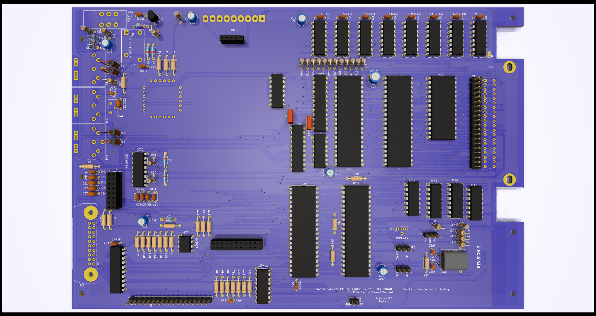

# DRAGON 32 RECREATION Rev 3 #

This project started as a recreation of the SA2120 CPU Mainboard
for the 1982 Dragon Data **Dragon 32**

Everything (excluding modifications) is taken from the SA2120
schematics. Where this version changes is that the options to
use banks of 16K DRAM is gone, you must use 64K DRAMs, with it
goes all the extra circuitry for configuring the memory for
different types of chip.

The ROM is now a single 27C256 eprom with an option to switch
between two images using JP6 or to allow the rom to be
automatically selected from the PIA.

A second ROM selection jumper is available at JP3 to be used
when a 27C512 is fitted. This swaps the value to A15 between
high and low. When a 27C256 is fitted this must be set low.

Hidden on the back of the board is a solder pad jumper (JP7) that
also needs setting to handle a 27C256 or 27C512. Bridging pad
1 sets pin 22 of the rom to ground, using pad 3 sets the
pin to use the ROM select signal shared with pin 20. When a
27C512 is fitted this must be set to pad 1.

The video circuits have been isolated from the rest of the
board to improve output quality.

A second (internal) cartridge port has been added, by way of
a 2x20 header, along with an additional +5V/Gnd pickup point
for further internal expansion.

An optional 256K banking solution is incorporated using the
design for Stewart Orchard's upgrade board and GAL design.
<https://gitlab.com/sorchard001/dragon-256k-banker-board>

## Progress ##

In the current state (3.0) none of the board is tested. This
is purely experimental although the schematics have been
tested with the previous rev 2 board and are largely unchanged.

## Modifications ##

### Joysticks ###

The two joystick ports provide a second fire button capability
wired to consecutive keyboard rows, as per the Tandy CoCo.
Unless a two button joystick is used this make no difference to
the operation of the computer. It also requires the use of 6-pin
DIN sockets, these are pin compatible with the 5-pin originals
so a regular single button joystick can still be used.

The two extra buttons can also be disabled by omitting L3 and L4.

### Parallel Port ###

A jumper (JP2) has been introduced to bypass the logic inverter
on the STROBE line. When bypassed the parallel port should
operate as a communication port for DRIVEWIRE.

### Memory Addressing ###

The board is configurable between 32k and 64k ram addressing
using jumper JP1. In most scenarios there is no reason to
disable the 64k option.

The upgrade to 256K needs the 4164s swapping for 41256s. The
pre-bridged jumper at JP5 needs cutting. The SAM also needs 
to be replaced with a 74LS785. The optional
components can then be fitted and should work without further
alteration.

### Video PIA ###

One of the possible features of the board is to support an
extended version of the video circuitry to include 
external character ram. Adding a third PIA to the board takes
a little refinement of how PIAs are interfaced. In this case
the mapped memory for PIA1 is broken into 8 blocks, this first
maps to the original memory space for PIA1 while the other 7 
are effectively available to more registers. On this board
only the first of those 7 is used (yet). This makes addresses
$FF44-$FF47 map to the new PIA (referenced here as 1b).

Register A of PIA1b is control of additional functions  
bit 0 controls internal or external character image generation  
bit 1 controls automatic invert on bit 6 of the data bus  
bit 2 is manual control of the invert signal  
bit 3 controls automatic semigraphics on bit 7 of the data bus  
bit 4 is manual control of the semigraphics signal  
bit 5 opens the external character ram to writing  
bit 6 is a clock trigger to the external character ram address  
bit 7 is unused (proposed to be CoCo compatibility switch for 
the keyboard)  

Register B of PIA1b is used for programming the external
character ram data.

The external character ram can only be programmed while the
video is set to the internal character data of the 6847.

## Substitutions ##

Many of the original components are simply unobtainable or
just very hard (and expensive) to locate. The transistors
will need modern substitutes as the BC141, BC212 and 2N2369
are all obsolete but thankfully these are fairly run-of-the-mill
transistors and shouldn't cause any particular issues.

The CPU and PIAs are all fairly easy to obtain online
and possibly even new (MC6821s are still made and there
are lots of compatible alternatives). A and B rated components
should all be usable but make sure the processor is an "09e".
The Hitachi HD6309 is usable but may cause crashes in some
software due to lazy coding.

### The Future ###

As these parts become harder to find it is inevitable that
replacements and redesigns will be needed. The most obvious
of these is the SAM chip. In 2023 these are pretty much
unobtainable without harvesting from another Dragon or CoCo.
In order to be viable the SAMs functionality needs to be
replicated in a modern CPLD, this opens up an opportunity
to incorporate the memory paging into a single chip, 
further reducing complexity on the board. In order to use
the ram banking the SAM already needs to be replaced with
a 74LS785, some supply of these does still exist but the
numbers are painfully small.
