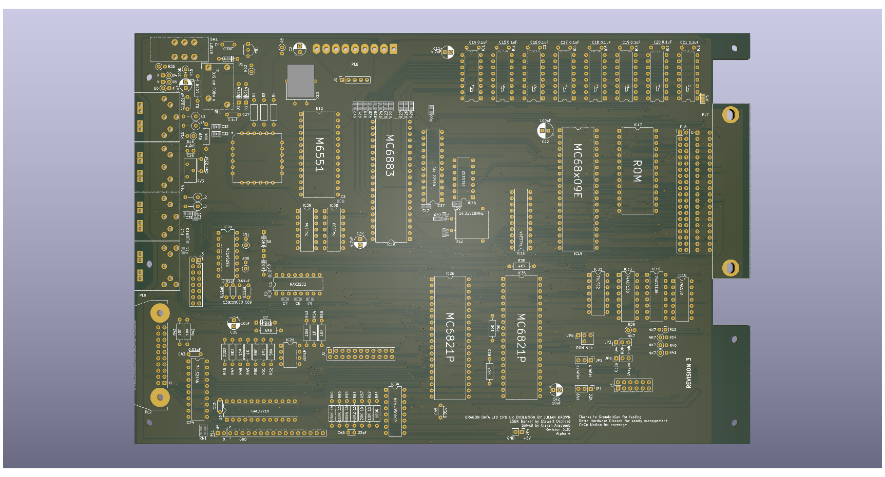

# DRAGON 32 RECREATION Rev 3 #

This project started as a recreation of the SA2120 CPU Mainboard
for the 1982 Dragon Data **Dragon 32**

Everything (excluding modifications) is taken from the SA2120
schematics. Where this version changes is that the options to
use banks of 16K DRAM is gone, you must use 64K DRAMs, with it
goes all the extra circuitry for configuring the memory for
different types of chip.

The ROM is now a single 27C256 eprom with an option to switch
between two images using JP6 or to allow the rom to be
automatically selected from the PIA.

A second ROM selection jumper is available at JP3 to be used
when a 27C512 is fitted. This swaps the value to A15 between
high and low. When a 27C256 is fitted this must be set low.

Hidden on the back of the board is a solder pad jumper (JP7) that
also needs setting to handle a 27C256 or 27C512. Bridging pad
1 sets pin 22 of the rom to ground, using pad 3 sets the
pin to use the ROM select signal shared with pin 20. When a
27C512 is fitted this must be set to pad 1.

The video circuits have been isolated from the rest of the
board to improve output quality.

A second (internal) cartridge port has been added, by way of
a 2x20 header, along with an additional +5V/Gnd pickup point
for further internal expansion.

An optional 256K banking solution is incorporated using the
design for Stewart Orchard's upgrade board and GAL design.
<https://gitlab.com/sorchard001/dragon-256k-banker-board>

## Progress ##

In the current state (3.3) most of the board is tested except
for the additional audio capabilities, SAMx8 compatibility and
the logic controlled switching of keyboard configuration.

## Modifications ##

### Joysticks ###

The two joystick ports provide a second fire button capability
wired to consecutive keyboard rows, as per the Tandy CoCo.
Unless a two button joystick is used this make no difference to
the operation of the computer. It also requires the use of 6-pin
DIN sockets, these are pin compatible with the 5-pin originals
so a regular single button joystick can still be used.

The two extra buttons can also be disabled by omitting L3 and L4.

### Parallel Port ###

A jumper (JP2) has been introduced to bypass the logic inverter
on the STROBE line. When bypassed the parallel port should
operate as a communication port for DRIVEWIRE.

### Memory Addressing ###

The board is configurable between 32k and 64k ram addressing
using jumper JP1. In most scenarios there is no reason to
disable the 64k option.

The upgrade to 256K needs the 4164s swapping for 41256s. The
pre-bridged jumper at JP5 needs cutting. The SAM also needs 
to be replaced with a 74LS785. The optional components can 
then be fitted and should work without further alteration.

The required JED file for the GAL22V10 that drives the memory
banking is in the CPLD folder of the project.

The 256K upgrade can be replaced with a SAMx8 upgrade board.
This replaces the SAM chip and the tristate buffer that sits
between the RAM and the CPU, and also allows connection to
the second data path that goes to the VDG. With this in place
the DRAM (either 4164 or 41256) is redundant, as is the GAL 
that provides the 256K banker capability.

### Video Port ###

The board includes a third connector for the video mezzanine
card. This exposes the video board to the CPU side of the
data bus along with control signals that would permit 
programming of the video for additional features. With a 
stock 6847 that might be to include a programmable character
"rom" but I'm also working on a synthetic FPGA based replacement
for the 6847 that will allow much bigger changes such as 
swappable/programmable colour palettes.

### Audio ###

The board provides a position to mount a custom implementation
of the AY sound generator. This provides three channels of 
synthesised sound without using the CPU intensive system that
the Dragon comes with by default. The capabilities are the same
as those of the Spectrum 128 models. You can even mix the old
and new methods of sound generation to create more noise!

Theoretically other sound generators could be used but the AY
option provides a cheap, capable mechanism that follows a 
standard familiar to users of other computers from the era.

### Keyboard ###

The board places a GAL chip between the input register of
PIA 1 and the keyboard connector. The GAL could be ommitted
and jumpers used to hardwire the connections to either
Dragon or CoCo compatibility.

With a GAL in place the wiring is controlled by a jumper.

## Substitutions ##

Many of the original components are simply unobtainable or
just very hard (and expensive) to locate. The transistors
will need modern substitutes as the BC141, BC212 and 2N2369
are all obsolete but thankfully these are fairly run-of-the-mill
transistors and shouldn't cause any particular issues.

The CPU and PIAs are all fairly easy to obtain online
and possibly even new (MC6821s are still made and there
are lots of compatible alternatives). A and B rated components
should all be usable but make sure the processor is an "09e".
The Hitachi HD6309 is usable but may cause crashes in some
software due to lazy coding.

Ciaran Anscomb's samX4 can be used to replace the SAM
chip and can be configured to operate as a 74LS783 or a
74LS785 to suit.

### The Future ###

As these parts become harder to find it is inevitable that
replacements and redesigns will be needed. After much hard
work by the Dragon and CoCo community the *only* IC on the
required, that is not still made or in plentiful supply is
the MC6847 VDG (the LM1889 on the PAL board is also in
limited supply but there are ways around the issue).

The Hitachi HD6309 has been in production until recently due
to military supply contracts making it easily accessible and
at reasonable cost. Ultimately this will diminish but with
supplies still high it seems likely to be available for a long
time yet.

The MC6821 is available new but at eye watering prices as
it is only made in small batches. The WD65C21 is a direct
swap and in much higher supply making it generally cheaper
than remaining original NOS parts.

The LS and CD discrete logic chips are all generally easy
to obtain and all have more modern equivalents that can be
swapped in.

Some searching may be needed for the cartridge port connector.
A direct replacement part is listed in the EDAC catalogue but
is only made to demand which requires an order of some 200
units. Lower quality but compatible parts can be found online.

Ultimately all of the parts will become hard to obtain but
for the foreseeable future the board should remain viable.
